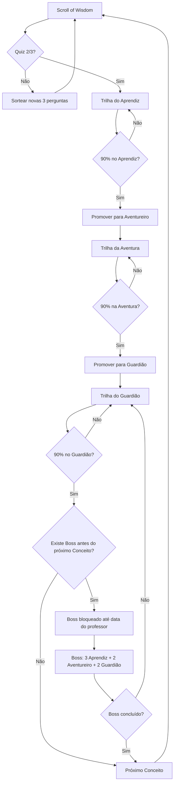
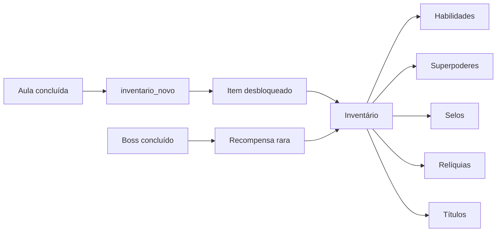

# Python Arcane — Especificação Consolidada para IA Generativa

## 1. Objetivo

Criar uma interface web de **RPG educacional para aprendizagem de Python**, usando **Nuxt 4 + Vue 3 + Tailwind**.

A interface deve comunicar claramente:

> O estudante é um aventureiro que usa código Python para resolver missões, ganhar XP, desbloquear habilidades e avançar no mapa.

Evitar aparência de dashboard, IDE comum ou site comercial.

## 2. Conceito visual

Usar estética de RPG educacional com:

* inventário de aventureiro;
* mapa de missões;
* HUD de RPG;
* arena de desafio;
* cartas de habilidade;
* terminal/oráculo de execução;
* imagens e diagramas pedagógicos.

Usar **Inventário** como conceito principal de progressão e recompensas.

Usar **Grimório** apenas para conteúdos teóricos, aba de conceitos, item especial ou skin de classe mágica.

## 3. Paleta funcional

| Cor         | Uso                                     |
| ----------- | --------------------------------------- |
| Cyan        | código, foco e energia técnica          |
| Violet      | habilidades especiais, magia e mistério |
| Emerald     | sucesso e testes aprovados              |
| Amber       | XP, ouro e recompensas                  |
| Rose        | erro, dano e falha                      |
| Slate/Black | fundo, estrutura e painéis              |

## 4. Layout desktop 16:9

Pensar primeiro em **desktop wide 16:9**.

O editor Python deve estar **sempre visível e sempre ativo**.

Layout principal:

```txt
┌──────────────────────────────────────────────────────────────┐
│ HUD: Nível | XP | Vida | Mana | Ouro | Missão ativa          │
├─────────────────┬───────────────────────────┬────────────────┤
│ Inventário/Mapa │ Editor Python sempre ativo│ Desafio atual  │
│ Missões         │ Oráculo / saída livre     │ Visual/Testes  │
│ Progresso       │ Executar / Submeter       │ Recompensas    │
└─────────────────┴───────────────────────────┴────────────────┘
```

Distribuição inicial:

| Coluna                     | Largura inicial | Mínimo |
| -------------------------- | --------------: | -----: |
| Esquerda — inventário/mapa |       14% a 18% |  220px |
| Centro — editor            |       48% a 56% |  560px |
| Direita — desafio          |       28% a 34% |  360px |

Requisitos:

* colunas redimensionáveis no desktop;
* divisores arrastáveis;
* limites mínimos;
* larguras salvas no `localStorage`;
* botão **Restaurar layout padrão**;
* em tablet/celular, usar abas, drawer, accordion ou painéis recolhíveis.

## 5. Tela-base única de desafio

Não criar telas separadas para **Battle Arena** e **Tower of Trials**.

Criar uma tela-base:

```txt
ChallengeArena.vue
```

Ela recebe `mode` ou `variant` conforme o JSON.

| Arquivo/tipo               | Modo           | Experiência                        |
| -------------------------- | -------------- | ---------------------------------- |
| `aula-XX-conceitos`        | `lesson`       | Scroll of Wisdom                   |
| `aula-XX-trilha-aprendiz`  | `trial`        | Apprentice Trail / Tower of Trials |
| `aula-XX-trilha-aventura`  | `battle`       | Adventure Trail / Battle Arena     |
| `aula-XX-trilha-guardiao`  | `battle-hard`  | Guardian Trail                     |
| `aula-XX-expedicao_guilda` | `group-battle` | Guilda                             |
| `aula-XX-boss`             | `marathon`     | Warmup + Boss Marathon             |
| `aula-XX-prova`            | `exam`         | Level Up Trial                     |

Estrutura comum:

* editor Python sempre ativo;
* execução livre sem pontuação;
* submissão oficial quando aplicável;
* coluna direita com enunciado, imagem, exemplos, testes e recompensas;
* HUD superior;
* inventário/mapa lateral;
* oráculo/console.

## 6. Renderização dos JSONs

A IA deve renderizar por `tipo`, `subtipo` e `secoes`, não apenas pelo nome do arquivo.

Campos frequentes:

```txt
id, curso, modulo, aula, numero, tipo, subtipo, titulo,
subtitulo, objetivo, duracao, tags, secoes, premio
```

Tipos reais:

```txt
Aula + conceito
Trilha + aprendiz
Trilha + aventura
Trilha + guardiao
Masmorra + boss
Masmorra + grupo
Masmorra + prova
```

## 7. Aula conceito — Scroll of Wisdom

Usar para `tipo: Aula`, `subtipo: conceito`.

Seções comuns:

```txt
abertura, conceito, pratica_guiada, pratica_autonoma, desafios, fechamento
```

A tela deve apresentar:

* objetivo da aula;
* situação/problema inicial;
* explicação conceitual;
* exemplos de código;
* prática guiada;
* prática autônoma;
* autoavaliação.

Regra de progressão:

* ao final, apresentar **3 perguntas teóricas difíceis**;
* exigir **mínimo de 2 acertos em 3**;
* se o estudante não atingir o mínimo, sortear novas 3 perguntas;
* evitar repetir o mesmo conjunto quando houver banco suficiente;
* manter o editor disponível, mas condicionar a aprovação ao quiz teórico.

## 8. Trilhas

Para `tipo: Trilha`, renderizar `secoes.desafios.missoes` como desafios autocorrigíveis.

| Subtipo    | Papel                                   |
| ---------- | --------------------------------------- |
| `aprendiz` | prática obrigatória em sala             |
| `aventura` | reforço/autonomia, geralmente para casa |
| `guardiao` | treino preparatório para boss/prova     |

Cada missão geralmente possui:

```txt
titulo, texto_md, meta
```

## 9. Masmorras

| Subtipo | Renderização                                               |
| ------- | ---------------------------------------------------------- |
| `boss`  | `aquecimento` sem pontos + `maratona` oficial com tempo    |
| `grupo` | formação de guilda, papéis, tempo comum e ranking coletivo |
| `prova` | banco de questões, sorteio editorial e nota acadêmica      |

A seção `backend` não deve aparecer integralmente ao estudante.

Uso correto de `backend`:

* autocorreção;
* datasets ocultos;
* geração de casos;
* validação técnica;
* visualização administrativa do professor.

## 10. Inventário e módulo

### `inventario.json`

Define categorias e superpoderes globais.

Renderizar:

* categorias por módulo;
* superpoderes disponíveis;
* superpoderes bloqueados;
* ícones;
* descrições;
* requisito de desbloqueio;
* busca e filtro.

Superpoder com `desbloqueio: null` pode aparecer como disponível, básico ou ainda sem regra definida.

Superpoder com `desbloqueio` aparece bloqueado até a conclusão da referência indicada.

### `modulo1.json`

Fonte para mapa e progressão do módulo.

Cada aula pode conter:

```txt
numero, rotulo, tipo_aula, subtipo, titulo, arquivo,
inventario_novo, premio, obrigatoria
```

Usar:

* `inventario_novo` para desbloquear itens;
* `premio` para pontos, recompensas e resumo;
* `obrigatoria` para diferenciar trilha principal e opcional.

## 11. Editor Python

A coluna central pertence ao editor.

Não colocar o enunciado completo na mesma coluna do editor.

A coluna central deve conter:

* título curto da missão ativa;
* editor grande e confortável;
* botão **Executar Código**;
* botão **Submeter Desafio**, quando aplicável;
* Oráculo do Código.

### Executar Código

Sempre disponível.

* não vale pontuação;
* não altera XP/ranking;
* serve para teste livre;
* mostra saída e erros no Oráculo.

### Submeter Desafio

Aparece somente em desafio autocorrigível.

* vale pontuação;
* executa testes oficiais;
* registra progresso;
* pode conceder XP, item, título ou desbloqueio.

## 12. Oráculo do Código

Usar como console/terminal temático.

Deve diferenciar:

* saída de execução livre;
* erro de execução livre;
* resultado de testes oficiais;
* submissão aceita;
* submissão recusada.

Feedback deve ser útil:

* erro de sintaxe;
* erro de execução;
* erro de formato;
* erro de lógica;
* saída esperada vs. saída obtida, quando permitido.

Evitar mensagem genérica como **errado**.

## 13. Coluna direita — desafio

A coluna direita é a área de compreensão do desafio.

Prioridade:

1. enunciado;
2. imagem/diagrama pedagógico;
3. entrada/saída;
4. exemplos em tabela;
5. testes/dicas;
6. inimigo/status/recompensas.

Usar abas ou accordion quando necessário:

```txt
Desafio | Visual | Exemplos | Dicas | Testes | Inimigo | Recompensas
```

## 14. Tabelas e casos de teste

`texto_md` pode conter tabelas Markdown, `<br>`, exemplos visíveis e casos ocultos.

Renderizar tabelas como componente visual:

* destacar entrada;
* destacar saída esperada;
* indicar caso visível/oculto pelo campo `Show`;
* respeitar `<br>`;
* permitir copiar entrada;
* permitir preencher entrada simulada quando aplicável.

## 15. Imagens e diagramas pedagógicos

Imagens não são decoração. Devem ajudar a entender o problema.

Exemplos:

| Conteúdo         | Visual sugerido      |
| ---------------- | -------------------- |
| Busca sequencial | vetor e ponteiro     |
| Busca binária    | início, meio e fim   |
| Sentinela        | item extra no final  |
| Matriz           | grade                |
| Ordenação        | barras/cartas        |
| Strings          | caracteres em blocos |

Requisitos:

* ficar próximo do enunciado;
* ter legenda curta;
* abrir ampliada em modal/lightbox;
* não competir com o editor;
* aceitar SVG, Canvas, imagem ou componente Vue.

## 16. Progressão obrigatória

Sequência principal por bloco:

```txt
Conceito → Aprendiz → Aventura → Guardião → próximo Conceito
```

Regra:

```txt
Conceito libera Aprendiz após quiz 2/3.
90% no Aprendiz libera Aventura.
90% na Aventura libera Guardião.
90% no Guardião libera o próximo Conceito.
```

Exceção:

```txt
Se o próximo Conceito estiver após um Boss, ele não é liberado apenas pelo Guardião.
Nesse caso, o Boss precisa ser realizado quando for aberto pelo professor.
```

Progressão por patente:

```txt
Aprendiz → Aventureiro → Guardião
```

Regra de promoção:

* todos começam como **Aprendiz**;
* 90% na Trilha do Aprendiz libera a patente **Aventureiro**;
* 90% na Trilha da Aventura libera a patente **Guardião**;
* 90% na Trilha do Guardião libera avanço para o próximo Conceito, exceto quando houver Boss antes dele.

Boss e prova não criam novas patentes. Eles concedem títulos, relíquias, selos, XP, recompensas raras e prestígio no ranking.

A promoção deve gerar feedback visual, recompensa e registro no inventário.

## 17. Liberação das Trilhas

A progressão entre trilhas deve seguir exigência de **90%**.

| Etapa              | Requisito para liberar próxima etapa                               |
| ------------------ | ------------------------------------------------------------------ |
| Scroll of Wisdom   | acertar 2 de 3 perguntas teóricas                                  |
| Trilha do Aprendiz | atingir 90% para liberar Aventura                                  |
| Trilha da Aventura | atingir 90% para liberar Guardião                                  |
| Trilha do Guardião | atingir 90% para liberar próximo Conceito, salvo bloqueio por Boss |
| Boss               | data/hora definida pelo professor                                  |
| Prova              | data/hora definida pelo professor                                  |

Regra de transição de dificuldade:

* quem atingir **90% na Trilha do Aprendiz** vira **Aventureiro**;
* Aventureiro deve seguir a **Trilha da Aventura**, mais difícil;
* quem atingir **90% na Trilha da Aventura** vira **Guardião**;
* Guardião deve seguir a **Trilha do Guardião**, que prepara para Boss ou libera o próximo Conceito;
* se houver Boss antes do próximo Conceito, o Conceito continua bloqueado até o Boss ser realizado/liberado conforme regra do professor.

Mensagem de progresso:

```txt
Aprendiz: 100% concluído
Aventura: 80% / 90%
Guardião: bloqueado
Falta: atingir 90% na Trilha da Aventura.
```

## 18. Liberação do Guardião

Guardião é **treino pré-boss** e também a última etapa de domínio antes do próximo Conceito.

Liberar Guardião somente após:

```txt
90% na Trilha da Aventura.
```

Exceções administrativas:

* professor pode liberar manualmente para casos específicos;
* professor pode abrir uma janela pré-boss para a turma;
* professor pode bloquear Guardião por data quando desejar controlar o ritmo.

Exibir prontidão:

```txt
Prontidão para o Boss: 68%
Pontos fortes: variáveis, input
Precisa treinar: formatação e divisão inteira
```

## 19. Boss e prova

Boss e prova dependem de data/hora definida pelo professor.

### Boss

Deve parecer evento especial.

* tela de preparação;
* warmup sem pontos;
* fase oficial com tempo;
* sequência de missões;
* cronômetro;
* recompensa rara;
* resultado final.

Composição obrigatória do Boss:

| Nível da questão | Quantidade |
| ---------------- | ---------: |
| Aprendiz         | 3 questões |
| Aventureiro      | 2 questões |
| Guardião         | 2 questões |

Total: **7 questões**.

O Boss deve avaliar domínio acumulado. Questões de nível Aprendiz verificam fundamentos; questões de nível Aventureiro verificam aplicação mais difícil; questões de nível Guardião verificam preparação avançada.

### Prova

Avaliação formal.

* banco de questões;
* sorteio editorial;
* nota acadêmica;
* tempo controlado;
* bloqueio/liberação por professor.

## 20. Estados visuais

| Estado        | Visual              | Ação                         |
| ------------- | ------------------- | ---------------------------- |
| Bloqueado     | cadeado + requisito | ver requisito                |
| Liberado      | brilho discreto     | entrar                       |
| Em andamento  | borda ativa         | continuar                    |
| Concluído     | selo/check          | revisar/repetir se permitido |
| Evento futuro | data/hora           | aguardar                     |
| Expirado      | opaco               | ver histórico                |

## 21. Game design RPG

Programação é o sistema de habilidades do jogo.

```txt
Código correto = habilidade bem executada
Erro de sintaxe = falha de execução
Erro lógico = ataque fraco/resistência
Testes aprovados = dano, XP e recompensa
Conceitos aprendidos = habilidades no inventário
```

## 22. Classes cosméticas e patentes

Separar **classe cosmética** de **patente por desempenho**.

### Classes cosméticas

Classes cosméticas não alteram nota nem dão vantagem acadêmica.

| Classe            | Fantasia         | Foco                      |
| ----------------- | ---------------- | ------------------------- |
| Mago              | runas e feitiços | abstração/lógica          |
| Guerreiro         | golpes           | prática/resistência       |
| Arqueiro          | mira             | precisão de saída         |
| Ladino            | atalhos          | soluções concisas         |
| Alquimista        | transformação    | entrada/conversão/cálculo |
| Engenheiro Arcano | mecanismos       | estrutura/depuração       |

### Patentes por desempenho

As patentes representam progressão meritocrática do estudante. Usar apenas **3 patentes**.

| Patente     | Como alcança                     | Trilha principal              |
| ----------- | -------------------------------- | ----------------------------- |
| Aprendiz    | início do jogo                   | Trilha do Aprendiz            |
| Aventureiro | acerta 90% da Trilha do Aprendiz | Trilha da Aventura            |
| Guardião    | acerta 90% da Trilha da Aventura | Trilha do Guardião / pré-boss |

Regra principal:

```txt
90% na Trilha do Aprendiz → vira Aventureiro.
90% na Trilha da Aventura → vira Guardião.
Guardião fica apto ao treino pré-boss e aos desafios mais difíceis.
```

Boss e prova devem conceder recompensas raras, títulos e prestígio, mas não novas patentes.

90% na Trilha do Guardião libera o próximo Conceito, exceto quando houver Boss obrigatório antes desse Conceito.

A patente atual deve aparecer no HUD, no perfil e no inventário.

Exemplo:

```txt
Classe: Alquimista
Patente: Aventureiro
Próximo rank: Guardião
Requisito: 90% na Trilha da Aventura
```

### Derrota, strikes, queda de status e trapaça

No Boss, as penalidades do estudante devem ser calculadas **somente ao final da masmorra**.

Para o professor, os strikes devem aparecer **em tempo real** no painel administrativo durante o Boss.

Erros durante o Boss geram **strikes** conforme a patente do estudante e o nível da questão errada.

Importante: strike não prova trapaça automaticamente. Strike indica inconsistência entre a patente atual e o domínio demonstrado. Suspeita de trapaça deve gerar revisão do professor.

O estudante não deve ver os strikes em tempo real. Ele pode ver apenas feedback normal do desafio, desempenho geral e penalidade final ao concluir o Boss, conforme regra da atividade.

#### Painel do professor durante o Boss

O professor deve ter um painel em tempo real com:

* estudante;
* patente atual;
* questão atual;
* nível da questão;
* acerto/erro;
* strikes acumulados;
* risco de queda de patente;
* suspeita de inconsistência;
* tempo restante;
* status da tentativa.

Estados sugeridos:

| Estado                    | Critério      |
| ------------------------- | ------------- |
| Normal                    | 0 a 2 strikes |
| Atenção                   | 3 a 4 strikes |
| Risco                     | 5 a 6 strikes |
| Crítico                   | 7 a 8 strikes |
| Queda obrigatória/revisão | 9+ strikes    |

O painel do professor deve atualizar imediatamente após cada submissão oficial no Boss.

#### Tabela de strikes no Boss

| Patente atual | Erra questão Aprendiz | Erra questão Aventureiro | Erra questão Guardião |
| ------------- | --------------------: | -----------------------: | --------------------: |
| Aprendiz      |              1 strike |                        — |                     — |
| Aventureiro   |             2 strikes |                 1 strike |                     — |
| Guardião      |             3 strikes |                2 strikes |              1 strike |

Regra:

```txt
Quanto mais baixo o nível da questão errada em relação à patente atual, maior a penalidade.
```

Exemplo:

```txt
Guardião errou questão Aprendiz → 3 strikes.
Guardião errou questão Aventureiro → 2 strikes.
Guardião errou questão Guardião → 1 strike.
```

#### Composição do Boss

O Boss possui 7 questões:

| Nível       | Quantidade |
| ----------- | ---------: |
| Aprendiz    |          3 |
| Aventureiro |          2 |
| Guardião    |          2 |

#### Penalidade por faixa de strikes

| Strikes finais | Consequência sugerida                                                                                                                                |
| -------------: | ---------------------------------------------------------------------------------------------------------------------------------------------------- |
|              0 | vitória limpa, recompensa completa                                                                                                                   |
|          1 a 2 | vitória com alerta leve ou derrota sem punição permanente                                                                                            |
|          3 a 4 | perda de prestígio/ranking do Boss e treino recomendado                                                                                              |
|          5 a 6 | perda de XP do evento, bloqueio de recompensa rara e status “em risco”                                                                               |
|          7 a 8 | queda para patente anterior ou revisão obrigatória do professor                                                                                      |
|      9 ou mais | queda obrigatória de patente; se envolver 3 erros em questões Aprendiz por Guardião, cai direto para Aprendiz e fica marcado para revisão pedagógica |

#### Regra de queda de patente

A queda de patente deve ser consequência forte e não deve apagar o histórico do estudante.

| Patente atual | Cai para    | Quando aplicar                                                                                                             |
| ------------- | ----------- | -------------------------------------------------------------------------------------------------------------------------- |
| Aventureiro   | Aprendiz    | 5+ strikes em Boss com falhas em questões Aprendiz                                                                         |
| Guardião      | Aventureiro | 5+ strikes totais ou falha grave em questões Aventureiro                                                                   |
| Guardião      | Aprendiz    | 9 strikes por errar as 3 questões Aprendiz do Boss, reincidência grave em fundamentos ou trapaça confirmada pelo professor |

Ao cair de patente:

* a queda normal deve ser de apenas uma patente por vez;
* exceção: Guardião que erra as 3 questões Aprendiz do Boss soma 9 strikes e deve cair direto para Aprendiz;
* Guardião com falhas graves de nível Aventureiro pode cair para Aventureiro;
* queda direta de Guardião para Aprendiz ocorre quando ele falha nos fundamentos de nível Aprendiz, por reincidência grave ou por trapaça confirmada;
* não apagar histórico, selos ou itens já conquistados;
* desativar benefícios/status da patente atual;
* exigir recuperação pela trilha anterior;
* recuperar patente ao atingir novamente 90% na trilha correspondente.

Recuperação:

```txt
Aventureiro rebaixado para Aprendiz → precisa fazer 90% na Trilha do Aprendiz.
Guardião rebaixado para Aventureiro → precisa fazer 90% na Trilha da Aventura.
Guardião rebaixado direto para Aprendiz → precisa refazer 90% no Aprendiz e depois 90% na Aventura.
```

#### Caso específico: Guardião errando questões Aprendiz

O Boss possui 3 questões de nível Aprendiz. Se um Guardião errar as 3:

```txt
3 erros Aprendiz × 3 strikes = 9 strikes
```

Consequência:

* queda obrigatória de Guardião para Aprendiz;
* perda da recompensa rara do Boss;
* redução ou anulação do ranking/prestígio do Boss;
* recomendação obrigatória de recuperação na Trilha do Aprendiz;
* marcação para revisão pedagógica do professor.

Isso não deve ser tratado automaticamente como trapaça, mas como falha grave nos fundamentos. Trapaça só deve ser marcada após análise de padrões adicionais ou revisão do professor.

## 23. XP, ranking e recompensa

Penalidades devem afetar primeiro o evento, depois o status geral.

Ordem recomendada:

1. reduzir ou zerar recompensa do Boss;
2. reduzir prestígio/ranking do Boss;
3. bloquear relíquias/títulos raros;
4. marcar status “em risco”;
5. rebaixar patente apenas em caso grave;
6. marcar suspeita para revisão quando houver padrão anormal.

Não reduzir XP global antigo de forma agressiva. Preferir:

```txt
XP total histórico permanece.
XP de temporada/evento pode ser reduzido.
Ranking do Boss pode ser reduzido.
Recompensa rara pode ser bloqueada.
```

### Suspeita de trapaça

Strikes altos podem indicar que o estudante avançou sem domínio, mas não provam trapaça.

Marcar para revisão do professor quando ocorrer:

* Guardião com muitos erros em questões Aprendiz;
* Aventureiro com muitos erros em questões Aprendiz;
* queda brusca de desempenho incompatível com histórico;
* acertos muito altos nas trilhas e desempenho muito baixo no Boss;
* padrões técnicos suspeitos detectados pelo sistema.

Ações possíveis antes da confirmação:

* suspender recompensa rara;
* suspender pontuação do Boss;
* marcar tentativa para revisão;
* exigir treino de recuperação.

Trapaça confirmada pelo professor pode gerar:

* perda da pontuação do Boss;
* perda da recompensa do evento;
* queda para patente anterior;
* registro interno;
* obrigação de refazer trilha compatível.

Mensagem de alerta:

```txt
Seu desempenho no Boss ficou abaixo do esperado para sua patente.
Conclua o treino recomendado para proteger seu status.
```

Mensagem de risco de queda:

```txt
Risco de queda de patente: sua pontuação de domínio ficou abaixo do mínimo esperado.
Uma nova falha grave pode exigir retorno à trilha anterior.
```

Mensagem de revisão:

```txt
Esta tentativa apresentou inconsistência de desempenho e foi marcada para revisão do professor.
A pontuação e as recompensas ficarão suspensas até análise.
```

## 24. Recompensas

Recompensas devem ter função emocional e pedagógica.

| Tipo       | Função                     |
| ---------- | -------------------------- |
| XP         | progressão geral           |
| Selo       | conclusão                  |
| Habilidade | conceito técnico aprendido |
| Superpoder | técnica extra              |
| Título     | prestígio                  |
| Relíquia   | recompensa rara de boss    |
| Cosmético  | personalização             |

Raridade:

| Raridade | Uso                                                          |
| -------- | ------------------------------------------------------------ |
| Comum    | conceitos e trilhas simples                                  |
| Incomum  | aventura                                                     |
| Raro     | guardião/guilda                                              |
| Épico    | boss                                                         |
| Lendário | desempenho excepcional em boss/prova, sem criar nova patente |

## 25. Guilda

Exedição da Guilda deve exigir cooperação real.

Requisitos:

* equipe com papéis;
* cada membro resolve uma parte;
* progresso coletivo;
* tempo comum;
* ranking por guilda.

Papéis sugeridos:

| Papel               | Função                      |
| ------------------- | --------------------------- |
| Escriba             | estratégia e saída esperada |
| Batedor de Bugs     | testes e erros              |
| Guardião da Lógica  | regras e condições          |
| Alquimista de Dados | conversões e cálculos       |
| Arauto              | submissão e organização     |

## 26. Dicas progressivas

Não entregar solução completa em desafio valendo pontuação.

| Tentativa | Dica                                   |
| --------- | -------------------------------------- |
| 1ª        | conceitual leve                        |
| 2ª        | entrada/processamento/saída            |
| 3ª        | formato ou exemplo parcial             |
| muitas    | sugerir voltar ao conceito ou Guardião |

## 27. Professor

Professor é o **Mestre da Jornada**.

Funções:

* liberar datas;
* abrir boss/prova;
* definir requisitos;
* ver desempenho;
* acompanhar strikes do Boss em tempo real;
* identificar risco de queda de patente;
* identificar inconsistência de domínio;
* identificar estudantes travados;
* liberar exceções;
* publicar eventos.

Não expor configuração técnica ao estudante.

## 28. Componentes sugeridos

```txt
components/
├── game/
│   ├── GameShell.vue
│   ├── GameHUD.vue
│   ├── InventorySidebar.vue
│   ├── ChallengeArena.vue
│   ├── QuestPanel.vue
│   ├── EnemyStatus.vue
│   ├── SkillActionBar.vue
│   └── RewardModal.vue
├── code/
│   ├── PythonCodeEditor.vue
│   ├── OracleConsole.vue
│   └── TestCaseList.vue
├── quest/
│   ├── QuestVisual.vue
│   ├── AlgorithmDiagram.vue
│   ├── ExampleTable.vue
│   └── VisualExplanationModal.vue
├── effects/
│   ├── AttackEffect.vue
│   ├── SkillEffect.vue
│   ├── HealEffect.vue
│   └── SyntaxErrorEffect.vue
└── rpg/
    ├── PlayerCard.vue
    ├── SkillCard.vue
    ├── InventoryItem.vue
    └── MissionNode.vue
```

## 29. Bibliotecas

* Tailwind CSS: layout e visual;
* GSAP: animações de habilidade, dano e impacto;
* VueUse Motion: microinterações;
* Pinia: estado do jogo;
* CodeMirror ou Monaco Editor: editor Python;
* Nuxt UI apenas para modal, tooltip, drawer, toast e formulários.

## 30. Prioridade de implementação

1. Layout desktop 16:9 em três colunas redimensionáveis.
2. Editor sempre visível e ativo.
3. Execução livre separada de submissão oficial.
4. Renderização por `tipo`, `subtipo` e `secoes`.
5. Coluna direita com enunciado, visual, exemplos e testes.
6. Inventário/mapa de missões.
7. Scroll of Wisdom com quiz 2/3.
8. Progressão obrigatória: Conceito → Aprendiz → Aventura → Guardião → próximo Conceito.
9. Promoção: Aprendiz → Aventureiro → Guardião.
10. Boss obrigatório antes de certos conceitos, liberado por data/hora do professor.
11. Boss com 3 questões Aprendiz, 2 Aventureiro e 2 Guardião.
12. Penalidades graduais, strikes do Boss em tempo real para o professor e revisão humana para suspeita de trapaça.
13. Feedback, dicas e recompensas.
14. Responsividade.

## 31. Mermaid — fluxo principal



## 32. Mermaid — inventário



## 33. Resultado esperado

A interface deve parecer um **RPG educacional**, não um painel administrativo.

Deve ficar evidente:

* executar livremente é experimentar;
* submeter desafio é ação oficial com pontuação;
* cada desafio é uma missão;
* imagem/diagrama ajuda a entender o problema;
* erros geram feedback útil;
* testes aprovados geram progresso;
* inventário mostra habilidades, itens, selos e títulos.
